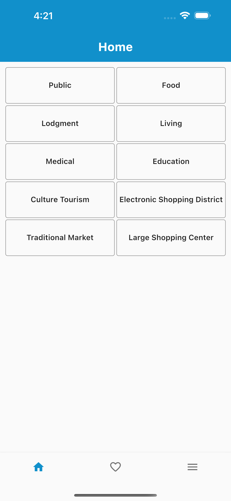
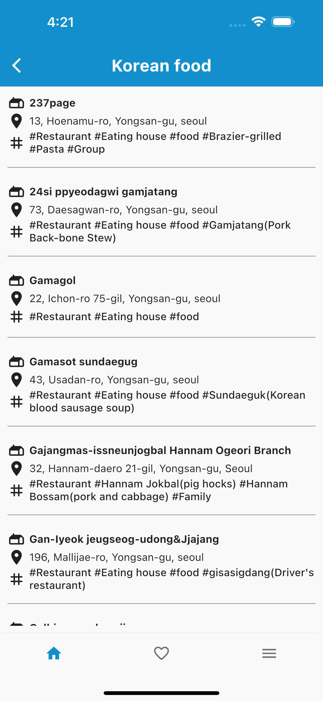
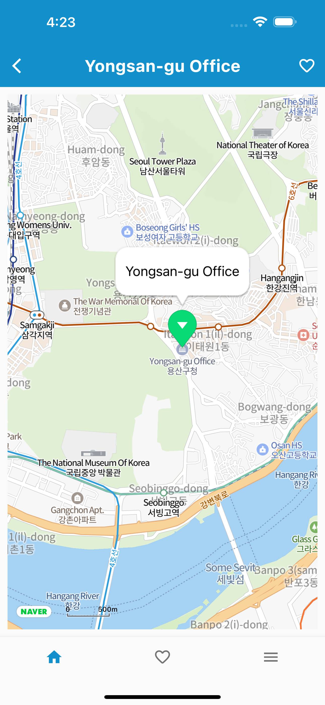
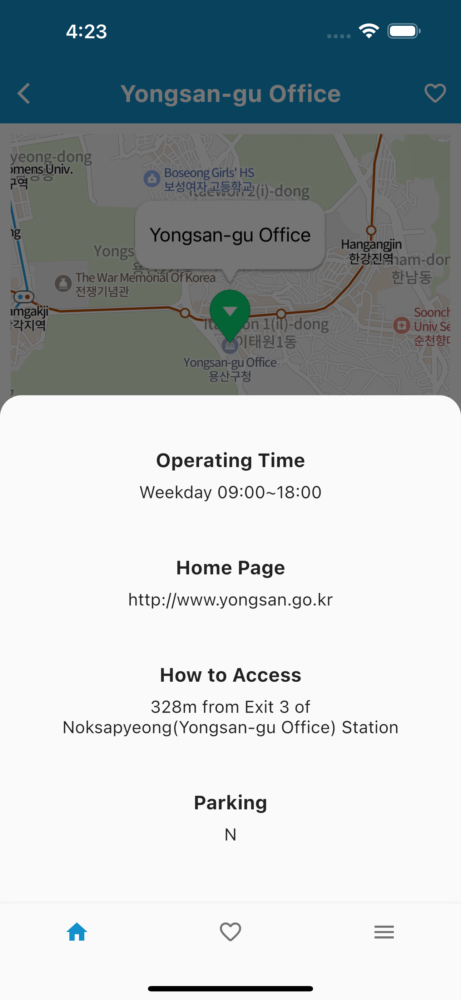
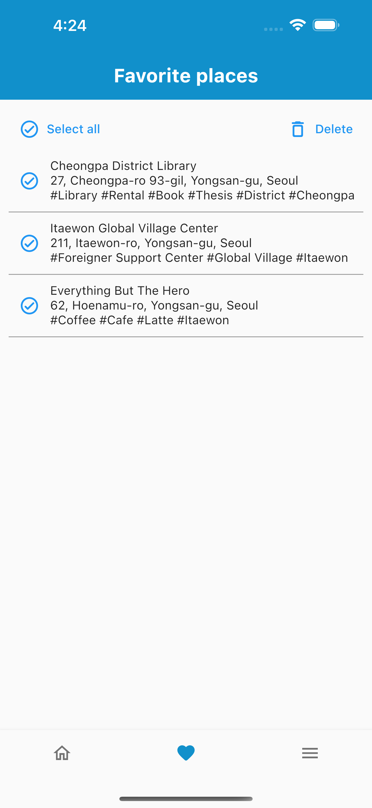

  

<h1 align="center">GuideYongsan</h1>

GuideYongsan is mainly to help foreigners who are not familiar with Hangul, Korean when staying in Yongsan find places in need.

All the infrastructure in Yongsan categorized for you to search easily such as restaurants, hotels, shopping centers, embassies and more.

For a more in-depth description, refer to the [documentation](./docs/) folder.

### Download the application from application stores

<!--  -->

<i>Android will be coming soon...</i>
 

<blockquote cite="https://support.google.com/googleplay/android-developer/answer/14151465?hl=en">
<small>Due to the fact that since November 2023, Google has changed their requirements for publishing Android applications that must meet the process; <i>"...closed test for your app with a minimum of 20 testers who have been opted-in for at least the last 14 days..."</i>
</small>
 <footer>—Play Console Help, <cite><a href="https://support.google.com/googleplay/android-developer/answer/14151465?hl=en">App testing requirements for new personal developer accounts</a>
</cite></footer>
</blockquote>

<strong>I am working on it! 💪🏼</strong>

## Documentation Contents

- [Directory Structure](./docs/directory_structure.md)
  - Declares the directory structure and overall architecture
- [Project Setup and Building](./docs/build.md)
  - Instructions on how to set up and build the project, information about used dependencies
- [Resources](./docs/resources.md)
  - Resources for developers

## Public Data Portal

GuideYongsan utilizes a given api from Public Data Portal [Yongsan-gu, Seoul_Convenience facilities/company inquiry service for foreigners](https://www.data.go.kr/en/data/15097096/openapi.do#/tab_layer_prcuse_exam).

More detail and usage guide, see [OGD Reuse Guides](https://www.data.go.kr/en/ugs/selectPublicDataUseGuideView.do#publicData_summary_03).

## Naver Map

GuideYongsan also uses [Naver Cloud Platform](https://www.ncloud.com/product/applicationService/maps). In order for it to work, you need to obtain your API key. After you create the key, you will also need to enable API for each platform. To enable Naver Map for Android, provide Android app package name e.g. "com.example.your_app". For iOS provide iOS Bundle ID e.g. "com.example.yourApp"

For more details, see [Prerequisites for using Maps](https://guide.ncloud-docs.com/docs/maps-spec).

If files contain Google Maps API are added to .gitignore, so your key will not be accidentally committed. Make sure you don't put your API keys anywhere else before pushing your work.

> 💡 _This README is a work-in-progress and will be soon updated with all necessary information about the application architecture, ways to build the project, and ways to contribute to this project._

---

## Screenshots

| Category                                               | Location List                                               | Map View                                               | Location Information                                               | Favorites                                               |
| ------------------------------------------------------ | ----------------------------------------------------------- | ------------------------------------------------------ | ------------------------------------------------------------------ | ------------------------------------------------------- |
|  |  |  |  |  |

---

## Application Log

Please check the whole story of GuideYongsan.

https://alabaster-caravel-721.notion.site/GuideYongsan-eb0c3cde567840988109fc5499f2be6e

---

@2024 [GuideYongsan](https://n01077202.wixsite.com/guideyongsan)
